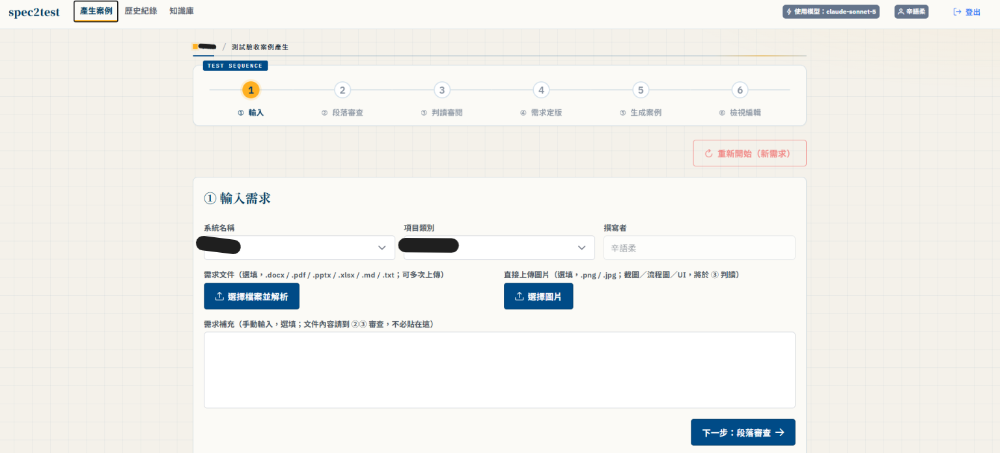
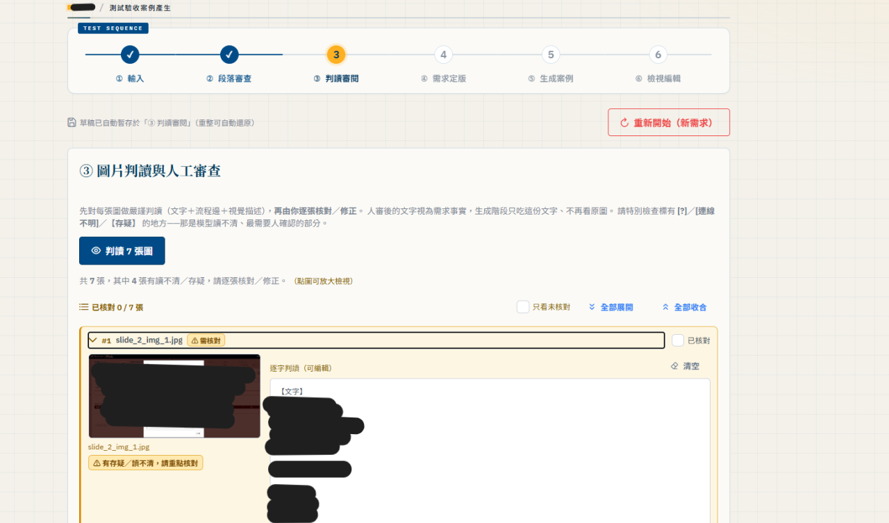
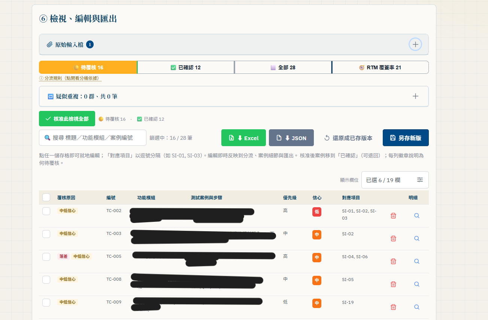
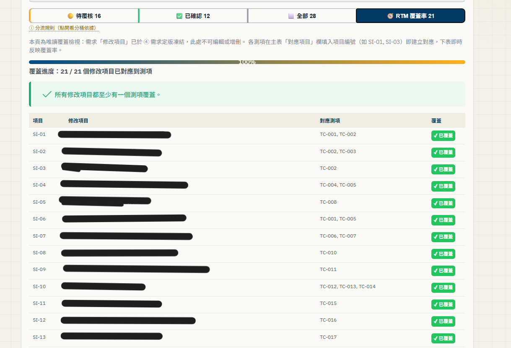

# spec2test — Spec-to-TestCase Generator

> A vision-LLM tool that turns engineering requirement documents into **review-ready, structured acceptance test
> cases**, with a **human-in-the-loop review gate** and a **machine-readable contract**
> for downstream test automation.
>
> 一套 Vision-LLM 工具，把工程需求文件自動轉成
> **可審閱的結構化驗收測試案例**，內建**人工審查關卡**，並輸出**給下游自動化用的機器可讀契約**。

<p align="center">
  
  <br><em>The 6-step wizard — upload → review → freeze → generate → triage → export.
  六步精靈：上傳 → 審查 → 凍結 → 生成 → 分流 → 匯出。</em>
</p>

<p align="center">
  <strong>▶ Live demo / 線上試玩：<a href="https://hachi282.github.io/spec2test/">hachi282.github.io/spec2test</a></strong>
  <br><em>Clean-room build — mock data, mocked LLM, no network. Walk the full 6-step pipeline in your browser.</em>
  <br><em>純前端 clean-room 版本，使用假資料與模擬 LLM、不連任何服務，可在瀏覽器走完整條 6 步流程。</em>
</p>

---

## Overview / 專案概述

During my software-engineering internship, I built the complete **end-to-end pipeline and
SPA** for an internal QA tool. It reads requirement documents in many formats — including
spec text trapped inside blurry images — transcribes them verbatim with a vision LLM, routes
every **low-confidence or discrepant** item through a **human review gate**, then generates
standards-aligned acceptance test cases and exports them as **Excel (for people)** and
**versioned JSON (for machines / downstream automation)**.

實習期間，我為一個內部 QA 工具打造了**完整的端到端處理流程與 SPA 介面**。它讀入多種格式的需求文件，
用 Vision LLM 逐字判讀圖片，把所有**低信心或有落差**的項目導入**人工審查關卡**，再產生符合公司規範的
驗收測試案例，輸出成 **Excel** 與 **JSON**。

---

## The problem / 問題

Writing acceptance test cases from requirement specs is slow and error-prone, and it gets
worse when the source material is messy:

- **Spec text is often trapped in images.** Requirements arrive as screenshots — tables,
  annotated diagrams, highlighted regions — where the meaningful text is *inside* a
  low-resolution picture, invisible to copy-paste or plain OCR.
- **Volume.** A single document can carry dozens of images across many pages.
- **Consistency.** Hand-written cases drift in granularity, expected-result detail, and
  API-call style between authors.
- **Trust.** An LLM that silently "reads" a blurry image and invents a requirement is
  worse than useless — it fabricates test coverage that looks real.

從需求規格人工撰寫驗收測試案例，不僅**耗時**，也**容易出錯**；當來源文件**格式不一致、內容零散**時，問題更加明顯。部分需求只以**標註形式出現在低解析度圖片中**，傳統 OCR 難以正確辨識；單份文件可能包含**數十張圖片**，需求資訊散落在文字與圖片之間；不同作者撰寫需求的**詳細程度與 API 描述方式也不一致**。更嚴重的是，如果 **LLM 誤解圖片內容、甚至自行補出原本不存在的需求，產生的測試案例雖看似完整，實際上卻沒涵蓋真正的需求**，反而讓人誤以為測試已經足夠。

## The approach / 方法

A staged, **trust-first** pipeline where the model proposes and a human disposes:

```
Upload → Vision transcribe → HUMAN REVIEW GATE → Generate → Triage & review → Export
 上傳      圖片逐字判讀        人工審查（可編輯）    生成       分流／人審       匯出
```

1. **Read, don't guess.** Each image is transcribed verbatim by a vision LLM. Every result
   carries a **confidence** signal.
2. **Human review gate.** Before *any* generation, transcriptions surface in an editable
   review step. The reviewer corrects/approves the text; **generation then trusts only the
   human-approved text — the raw image is never forwarded downstream.** This is the core
   anti-fabrication guardrail.
3. **Generate to a standard.** Approved requirements are chunked and turned into acceptance
   cases whose granularity and style are anchored by few-shot examples.
4. **Triage everything risky.** Generated cases are auto-routed to a review queue based on
   risk badges — *discrepancy*, *medium/low confidence*, *suspected duplicate* — so humans
   spend attention where it matters.
5. **Export two ways.** Human-friendly **Excel** and a **schema-versioned JSON contract**
   for downstream test-automation tooling.

我採用「**模型提出建議、由人做最終決定**」的分階段流程，並將**可信度與可追溯性**置於首位。系統先從圖片中**逐字擷取原始文字**，同時標示模型**信心值**，不主動推測或補齊缺漏；接著，所有辨識結果都必須經過**人工審閱與修正**，才能進入生成階段。後續模型**只使用人工確認過的文字，不直接接觸原始圖片**，以降低誤讀或捏造需求的風險。生成時透過 **few-shot 範例**統一測試案例的詳細程度與撰寫風格。此外，系統會以「**內容落差**」、「**中低信心**」及「**疑似重複**」三類標記呈現風險，協助審查者**優先處理需要關注的項目**。最終成果可匯出為供人員檢視的 **Excel**，以及供系統串接與版本管理的 **JSON**。

<p align="center">
  
  <br><em>The human review gate — the vision LLM's per-image transcription is editable, and items
  flagged in-doubt are surfaced for correction <strong>before</strong> generation. Generation trusts
  only the approved text; the raw image is never forwarded.
  人工審查關卡：Vision LLM 的逐張判讀可編輯，標記「存疑」的項目在生成<strong>之前</strong>先請人核對；
  生成只信任核准後的文字，不再回看原圖。</em>
</p>

## Architecture / 架構

```
┌─────────────┐      ┌──────────────────────────────────────────────┐
│   Vue 3 SPA │◄────►│  FastAPI  (thin HTTP boundary)                 │
│  6-step     │ /api │  ────────────────────────────────────────────  │
│  wizard     │      │  Core pipeline (UI-decoupled):                 │
│  PrimeVue   │      │   read → chunk → generate → dedup → RTM → export│
└─────────────┘      └───────────────┬────────────────┬──────────────┘
                                     │                │
                              ┌──────▼─────┐   ┌──────▼──────┐
                              │ Vision LLM │   │  MongoDB     │
                              │ (transcribe│   │ (run history,│
                              │ + generate)│   │  case vers., │
                              └────────────┘   │  drafts)     │
                                               └─────────────┘
```

- **Frontend:** Vue 3 + PrimeVue + Vite SPA; a 6-step wizard with an editable review gate,
  a triage data-table, coverage view, and export.
- **Backend:** FastAPI as a **thin HTTP boundary** over a **UI-decoupled core pipeline**
  (reading, chunking, generation, dedup, RTM, export) — the same core ran headless before
  the SPA existed.
- **Persistence:** MongoDB stores run history, requirement sets, and case versions under a
  curated **whitelist** — metadata, generated cases, and human-reviewed *text* in the main
  document, with **review images kept out-of-line in GridFS (referenced by pointer)**. It
  never stores the original full spec text, prompt content, or secrets.

Full diagrams and the design rationale live in [`docs/`](docs/).

## My contributions / 我的貢獻

- **Designed and built the human-in-the-loop review gate** — the anti-fabrication guardrail
  that made the tool trustworthy: transcribe → *human edits/approves* → generate from
  approved text only, raw images never forwarded.
- **Owned the Vue 3 SPA** — the 6-step wizard, editable review steps, a risk-triage
  data-table with reason badges, coverage view, and dual-format export.
- **Requirements Traceability Matrix (RTM)** in two phases (items → freeze → cases) so every
  generated case maps back to a numbered requirement.
- **Near-duplicate detection** to fold source-overlap cases (overview ↔ detail) into a
  review signal instead of noise.
- **MongoDB persistence** with a whitelist storage discipline and a connection-keepalive
  fix for firewall-idled sockets.
- **Frontend resilience** — e.g. moved large draft image bytes from localStorage (which
  overflowed its ~5 MB quota and silently dropped images) to **IndexedDB**, so an 80-image
  draft survives a page refresh. (See [`docs/challenges.md`](docs/challenges.md).)
- **Robust generation at scale** — structure-aware chunking (character threshold + requirement
  density + per-chunk image budget) with **truncation self-healing**: an over-long response is
  detected and the chunk re-split and regenerated instead of silently dropping cases; chunks
  run in parallel under a global concurrency limit.
- **Correctness under concurrency & load** — fixed usage accounting that leaked across
  concurrent requests (context-local counters), replaced a fixed request deadline with
  **streaming + idle-timeout** so honest long jobs finish while stuck ones fail fast, and added
  a concurrency gate + upload limits for traffic resilience.
- **A pytest regression net** (100+ cases) guarding core reading/chunking/transcription
  behavior and the downstream contract, plus a **line-by-line audit** that caught silent-failure
  paths (swallowed errors, plausible-but-wrong return values).

- **設計並實作人工審查機制** — 建立 **「模型辨識 → 人工編輯與核准 → 依核准文字生成」** 流程。生成階段**僅使用人工確認過的文字**，不將原始圖片傳入生成模型，**降低模型誤讀或捏造需求的風險**。
- **獨立設計並開發 Vue 3 SPA** — 打造**六步驟操作精靈**，整合可編輯的人工審查、附帶原因標記的**風險分流**、需求覆蓋檢視，以及 **Excel／JSON 雙格式匯出**。
- **建立需求追溯矩陣（RTM）** — 採用「**需求項目整理與凍結 → 測試案例生成**」兩階段流程，讓每一筆測試案例都能**追溯至對應的需求編號**。
- **實作近似重複偵測** — 識別總覽與細節等不同來源之間的重疊內容，將疑似重複項目轉化為**可供人工判斷的審查訊號**，減少重複案例與無效資訊。
- **導入 MongoDB 持久化** — 採用**白名單欄位儲存策略**，避免非預期資料寫入；同時改善**閒置連線遭防火牆中斷**的問題，強化資料庫連線的穩定性。
- **強化前端資料保存韌性** — 將大量草稿圖片由容量有限的 localStorage 遷移至 **IndexedDB**，避免超過約 5 MB 容量限制導致圖片遺失，確保包含 **80 張圖片的草稿**在頁面重新整理後仍可完整還原。
- **大量文件下的穩健生成** — 設計依內容結構的切分（字數門檻＋需求密度＋每段圖片預算），並加上**截斷自我修復**：偵測到過長回應時把分段再切細、重生，而非默默掉案例；分段以全域並行上限平行處理。
- **並行與流量下的正確性** — 把用量計數移入 context-local 儲存，修掉並行請求間互相污染的計量錯誤；以**串流＋閒置逾時**取代固定請求時限，讓健康的長工作跑完、卡死的快速失敗；並加入並行閘道與上傳限制以承受流量。
- **建立 pytest 回歸測試套件（100+ 筆）** — 涵蓋圖片擷取、內容切分、模型判讀及輸出契約等核心行為，並做過一次**逐行審查**揪出「吞掉錯誤或回傳看似合理卻錯誤值」的無聲失敗路徑，**降低功能調整造成回歸或破壞下游相容性的風險**。

<p align="center">
  
  <br><em>The triage table — every generated case carries reason badges (discrepancy /
  medium-low confidence / suspected duplicate), maps to its requirement IDs, and exports to
  Excel or versioned JSON. Editing a cell re-flows triage in place.
  風險分流表：每筆案例帶有原因徽章（落差／中低信心／疑似重複），對應到需求編號，並可匯出 Excel 或帶版本的 JSON；就地編修即時反映分流。</em>
</p>

<p align="center">
  
  <br><em>The Requirements Traceability Matrix — each <strong>frozen</strong> requirement maps to
  the cases covering it, with uncovered items flagged as coverage gaps.
  需求追溯矩陣（RTM）：每條<strong>凍結後</strong>的需求對應到覆蓋它的案例，未覆蓋者標為覆蓋缺口。</em>
</p>

## Tech stack / 技術棧

`Vue 3` · `PrimeVue` · `Vite` · `Pinia-style composables` · `IndexedDB` ·
`Python` · `FastAPI` · `MongoDB` · `pytest` · `Vision LLM / prompt engineering` ·
`Excel / JSON export`

## Results / 成果

- **Faster workflow:** turned a manual, hours-long authoring task into a **review-and-approve** flow.
- **Lower fabrication risk:** generation consumes only human-approved text.
- **Automation-ready:** output is structured and stable enough for downstream test automation to consume directly.
- **Refactor safety:** a 100+ case regression net guards core behavior, so the team catches unintended changes early.

- **流程提效**：把原本耗時**數小時**的人工撰寫，轉為**審查並核准**的工作流程，大幅降低人工作業負擔。
- **降低捏造風險**：生成階段**僅使用人工核准的文字**，避免模型直接依據原圖自行推測需求。
- **支援自動化串接**：輸出結構穩定，下游測試自動化可**直接取用**。
- **保障重構品質**：以**百餘筆回歸測試**守住核心行為，協助團隊**及早發現非預期變更**。

---

## Repository layout / 目錄

| Path | What |
|------|------|
| [`README.md`](README.md) | This case study (résumé landing page) |
| [`docs/architecture.md`](docs/architecture.md) | Architecture & pipeline diagrams |
| [`docs/design-decisions.md`](docs/design-decisions.md) | Key trade-offs and why |
| [`docs/challenges.md`](docs/challenges.md) | Engineering problems I solved (before/after) |
| [`resume/bullets.md`](resume/bullets.md) | Copy-paste résumé bullets (中／EN) |
| [`screenshots/`](screenshots/) | De-identified UI screenshots (+ how-to) |
| [`demo/`](demo/) | Clean-room runnable demo (mock data, GitHub-Pages-ready) |

## Try the demo / 試跑 Demo

**▶ Live (no install): [hachi282.github.io/spec2test](https://hachi282.github.io/spec2test/)**

Or run it locally / 或在本機執行：

```bash
cd demo
npm install
npm run dev      # local
npm run build    # static build → deploy to GitHub Pages
```

The demo uses **mock data and a mocked LLM** (canned responses) — no network, no services,
no proprietary code. It walks the full pipeline on a synthetic sample document so anyone can
see the flow end-to-end. See [`demo/README.md`](demo/README.md).

---

<sub>De-identified portfolio artifact. Built during a software-engineering internship, 2026.
Contains no employer-specific identifiers, endpoints, credentials, or proprietary source.</sub>
