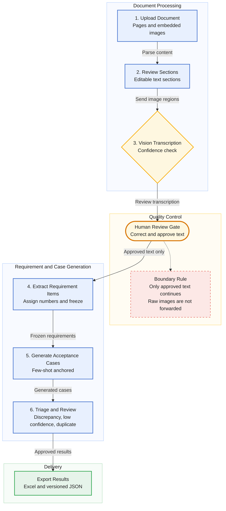
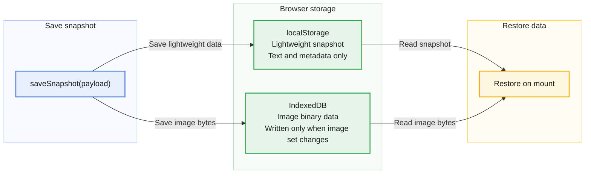

# Architecture / 架構

## System overview / 系統總覽

```mermaid
flowchart LR
    subgraph FE["Frontend"]
        direction TB
        W["Vue 3 SPA<br/>6-step wizard"]
        RG["Human Review Gate<br/>Editable content"]
        TT["Triage Data Table<br/>Reason badges"]

        W --> RG --> TT
    end

    subgraph BE["FastAPI Boundary"]
        direction TB
        API["API Routes<br/>/api routes/"]
    end

    subgraph CORE["Core Pipeline"]
        direction LR
        RD["Read and<br/>Transcribe"]
        CH["Chunk<br/>Content"]
        GEN["Generate<br/>Cases"]
        DUP["Detect<br/>Duplicates"]
        RTM["Build<br/>RTM"]
        EXP["Export<br/>Results"]

        RD --> CH --> GEN --> DUP --> RTM --> EXP
    end

    subgraph SERVICES["External Services"]
        direction TB
        LLM["Vision LLM<br/>Transcription and generation"]
    end

    subgraph DATA["Data Layer"]
        direction TB
        DB[("MongoDB<br/>History, versions, and drafts")]
    end

    W <--> API
    RG <--> API
    TT <--> API

    API -->|Start pipeline| RD
    EXP -->|Return results| API

    RD <-->|Transcribe images| LLM
    GEN <-->|Generate cases| LLM

    API <-->|Save and restore| DB
    CORE <-->|Persist pipeline data| DB

    classDef frontend fill:#E8F0FE,stroke:#4C78D0,stroke-width:2px,color:#1F1F1F
    classDef review fill:#FEF7E0,stroke:#F9AB00,stroke-width:2px,color:#1F1F1F
    classDef api fill:#F3E8FD,stroke:#9334E6,stroke-width:2px,color:#1F1F1F
    classDef pipeline fill:#E6F4EA,stroke:#34A853,stroke-width:2px,color:#1F1F1F
    classDef external fill:#FEF7E0,stroke:#F9AB00,stroke-width:2px,color:#1F1F1F
    classDef database fill:#FCE8E6,stroke:#D93025,stroke-width:2px,color:#1F1F1F

    class W,TT frontend
    class RG review
    class API api
    class RD,CH,GEN,DUP,RTM,EXP pipeline
    class LLM external
    class DB database

    style FE fill:#F8FAFF,stroke:#AECBFA,stroke-width:1px,color:#1F1F1F
    style BE fill:#FBF7FF,stroke:#D7AEFB,stroke-width:1px,color:#1F1F1F
    style CORE fill:#F7FCF8,stroke:#A8DAB5,stroke-width:1px,color:#1F1F1F
    style SERVICES fill:#FFFCF3,stroke:#FDD663,stroke-width:1px,color:#1F1F1F
    style DATA fill:#FFF8F7,stroke:#F6AEA9,stroke-width:1px,color:#1F1F1F

```

**Key idea:** the core pipeline is **fully decoupled from the UI**. It ran headless (as a
library) before the SPA existed; the SPA and the FastAPI layer are a thin shell around it.
This kept the business logic testable and let the UI be rewritten without touching the core.

**核心概念**：核心管線採 **UI-agnostic 設計**，可在無前端介面的情況下，以**函式庫形式獨立執行**。FastAPI 與 Vue SPA 僅作為輕量的 API 與呈現層，使核心商業邏輯具備良好的**可測試性**，也讓前端能獨立替換或重構。

## Pipeline Walkthrough / 端到端處理流程

The dashed edge is the whole point: **after the review gate, generation consumes only the
human-approved text — the raw image never travels downstream.** No approved text, no
generated case. This is what makes the output trustworthy rather than a plausible hallucination.

**圖中的虛線代表系統的信任邊界：** 通過人工審查後，生成階段只使用**經人工確認的文字**，**原始圖片不再傳入生成模型**。未經人工核准的內容不會用來產生測試案例，藉此降低模型誤讀或自行補造需求的風險，讓輸出建立在**可確認的需求依據**上，而不只是表面合理。

## Two-phase RTM / 兩段式需求追溯矩陣

Requirement traceability is split into two phases so that generated cases can always be
mapped back to a stable, numbered requirement:

```mermaid
flowchart LR
    subgraph Planning["Phase 1 - Requirement Planning"]
        direction TB
        P1["Requirement Items<br/>Edit and renumber locally"]
    end

    subgraph Baseline["Baseline"]
        direction TB
        FRZ(["Freeze Requirements<br/>Assign stable item IDs"])
    end

    subgraph Generation["Phase 2 - Case Generation"]
        direction TB
        P2["Generate Test Cases<br/>Link to frozen item IDs"]
    end

    subgraph Traceability["Coverage and Traceability"]
        direction TB
        M["RTM Coverage View<br/>Map items to test cases"]
    end

    P1 -->|Finalize requirements| FRZ
    FRZ -->|Lock item IDs| P2
    P2 -->|Build traceability| M

    classDef planning fill:#E8F0FE,stroke:#4C78D0,stroke-width:2px,color:#1F1F1F
    classDef freeze fill:#FEF7E0,stroke:#F9AB00,stroke-width:2px,color:#1F1F1F
    classDef generation fill:#E8F0FE,stroke:#4C78D0,stroke-width:2px,color:#1F1F1F
    classDef coverage fill:#E6F4EA,stroke:#34A853,stroke-width:2px,color:#1F1F1F

    class P1 planning
    class FRZ freeze
    class P2 generation
    class M coverage

    style Planning fill:#F8FAFF,stroke:#AECBFA,stroke-width:1px,color:#1F1F1F
    style Baseline fill:#FFFCF3,stroke:#FDD663,stroke-width:1px,color:#1F1F1F
    style Generation fill:#F8FAFF,stroke:#AECBFA,stroke-width:1px,color:#1F1F1F
    style Traceability fill:#F7FCF8,stroke:#A8DAB5,stroke-width:1px,color:#1F1F1F

```

- **Phase 1** — extract and edit requirement *items*; renumber locally as rows change.
- **Freeze** — assign stable IDs; this is the contract boundary.
- **Phase 2** — generate cases linked to frozen IDs, so coverage ("which requirement has no
  case?") is computable.

**採用兩階段流程**，確保「測試案例 ↔ 需求」可準確追溯：先擷取並編輯**需求項目**，確認後**凍結並賦予穩定 ID**；再依凍結內容生成案例，綁定對應的需求 ID。藉此可**計算需求覆蓋率**，並快速找出尚未被測試案例涵蓋的需求。

## Storage discipline / 資料儲存原則

MongoDB persistence keeps what the review workflow needs while minimizing the sensitive
surface. Large binaries are stored **out-of-line in GridFS**; the main document holds only
pointers.

| Stored in MongoDB ✅ 保存 | Never stored ❌ 不保存 |
|---|---|
| **Run metadata** — timestamps, step, counts **執行中繼資料** — 時間戳、步驟、計數 | **Original full spec text** **原始 SRS 全文** |
| **Generated cases** + requirement sets / versions **生成案例** + 需求集／版本 | **Prompt content** **提示詞內容** |
| **Human-reviewed text** — approved transcriptions **人工審查後的文字** — 核准的轉錄結果 | **Secrets / credentials** **金鑰與憑證** |
| **Images in GridFS** — review images + source uploads, by pointer **GridFS 圖片** — 審查圖與原始上傳檔，以指標參照 | **Employer-identifying info** **任何可識別雇主的資訊** |

Because image bytes live in GridFS behind pointers (not the original full spec text, not
inline blobs), **loading a saved run back into the review step restores both the reviewed
text and its images** — so a reviewer resumes exactly where they left off. This is a
deliberate exception to "store less": the review step needs each image next to its
transcribed text. (It is a separate mechanism from the browser-local draft below, which
solves "survive a refresh" on the client side.)

**MongoDB 僅保存人工審查所需的資料，以降低敏感資料的留存範圍。** 大型圖片存放於 **GridFS**，主文件只保留**檔案 ID**，且不保存完整的原始 SRS。載入歷史紀錄時，系統會一併**還原人工審查文字與對應圖片**，讓審查者接續編輯並逐圖比對。保留圖片是「最少留存」原則下的**刻意例外**，也是支援人工審查所必需的設計。

這與瀏覽器端的**本機草稿機制分屬不同層級**：後端負責保存可接續的**審查紀錄**，前端則確保頁面重新整理後，**尚未送出的草稿不會遺失**。

## Client-side draft storage / 前端草稿儲存

Draft autosave is split across two browser stores to survive refresh without hitting
localStorage's ~5 MB quota:

**將草稿分別保存於兩種瀏覽器儲存空間：**文字與中繼資料存入 **localStorage**，圖片位元組則存入 **IndexedDB**，並只在圖片集變動時更新。這項設計避開了 localStorage **約 5 MB 的容量限制**，也確保頁面重新整理後仍能完整還原草稿。

See [`challenges.md`](challenges.md) for the before/after on this one.

## Resilience patterns / 系統韌性與防護機制

- **Fail-closed auth** — under an auth-enabled deployment, a request missing valid identity
  is denied, never defaulted open on an auth hiccup.
- **Concurrency guard** — a cross-request gate bounds how many heavy jobs run at once, so a
  load spike can't destabilize the system.
- **Streaming self-heal** — truncated or unterminated streamed responses are detected and
  either recovered or surfaced as an error, never silently half-saved as success.
- **No silent drops** — when something is discarded (e.g. images over the cap), the UI says
  exactly what was dropped instead of pretending everything was kept.

**驗證失敗即拒絕（Fail-closed）**：在啟用身分驗證的環境中，若請求缺少有效的身分資訊，系統會**直接拒絕存取**，不會因驗證異常而預設放行。

**重量級工作的併發控管**：透過**跨請求共用的閘門**，限制可同時執行的重量級工作數量，避免瞬間負載過高而影響系統穩定性。

**串流中斷偵測與復原**：主動偵測遭截斷或未完整結束的串流回應，並嘗試**復原或回報錯誤**，避免將不完整的結果誤存為成功資料。

**資料捨棄必須明確告知**：若部分內容因容量或數量限制而無法保留，例如圖片超出上限，介面會**清楚提示被捨棄的項目**，不會讓使用者誤以為資料已完整保存。
